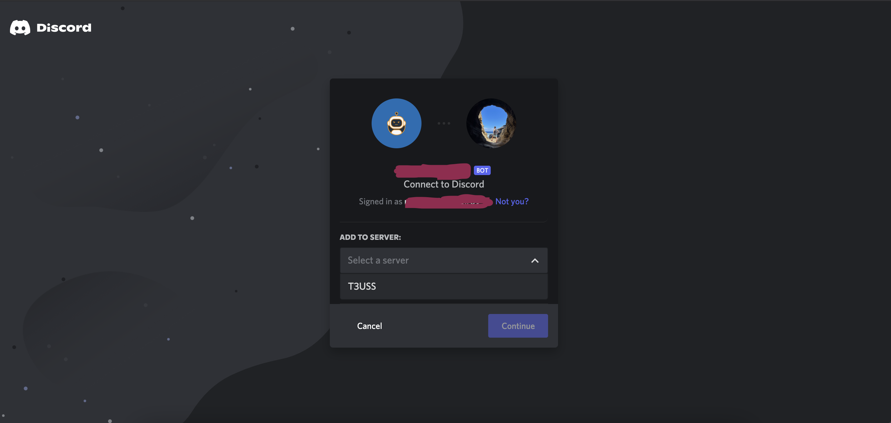

# Local Development Guide

This guide will help you get started with local development.

In this guide, you will start a local server instance of Ava for either Discord or Slack.

## Prerequisites

* [Node.js](https://nodejs.org/en/) v16 or greater
* [Docker](https://www.docker.com/products/docker-desktop) (optional)
* A [Discord](https://discord.com/) account **or** a [Slack](https://slack.com/) workspace

---

## Discord Setup

### Create Test bot

Follow the steps in this [tutorial](https://www.freecodecamp.org/news/create-a-discord-bot-with-python/) to create an Ava test bot.

Once you have the bot created. Go to the Oauth section and assign permissions to the test bot.

Ava needs the following permissions Oauth scopes.


The bot also needs the following permissions.


To invite Ava to a Discord test channel, use the generated URL. Add the generated URL to your browser search bar and visit the URL.


The next page will take you to the bot channel invite page. Go ahead and select your Discord channel of where you want to test the bot.



### Bot Token

The bot token can be found on your test application's bot page. You will need the token value for the next step.


### Start the local server

There are two methods for starting Ava locally. You can use Docker or run it as a node.js process.

#### Docker

```shell
docker run -e AVA_DISCORD_TOKEN="<token>" circa10a/ava
```

#### Non-Docker

```shell
npm run start
```

You should see a message when the server is up and running.
```
[INFO] Ready! Logged in as ...
```

### Verify Ava (Discord)

Go visit your Discord test channel to verify the test bot is operational.

Go ahead and issue the `ava help` command in the channel. If everything is working correctly, you should see a reply containing all the available Ava commands.


---

## Slack Setup

### Create a Slack App

1. Go to [api.slack.com/apps](https://api.slack.com/apps) and click **Create New App**.
2. Choose **From scratch**, give it a name (e.g. `Ava`) and select your workspace.

### Enable Socket Mode

1. In your app settings, go to **Socket Mode** and enable it.
2. Generate an **App-Level Token** with the `connections:write` scope. Save this token — it is the `AVA_SLACK_APP_TOKEN` (starts with `xapp-`).

### Configure Bot Token Scopes

Go to **OAuth & Permissions** and add the following **Bot Token Scopes**:

- `chat:write` — Send messages
- `channels:history` — Read messages in public channels
- `groups:history` — Read messages in private channels
- `im:history` — Read direct messages
- `mpim:history` — Read group direct messages

### Enable Event Subscriptions

Go to **Event Subscriptions** and enable events. Under **Subscribe to bot events**, add:

- `message.channels`
- `message.groups`
- `message.im`
- `message.mpim`

### Install to Workspace

Go to **Install App** and install it to your workspace. Copy the **Bot User OAuth Token** — this is the `AVA_SLACK_BOT_TOKEN` (starts with `xoxb-`).

### Invite the Bot

Invite the bot to a channel by typing `/invite @Ava` in the channel.

### Start the local server

#### Docker

```shell
docker run -e AVA_SLACK_BOT_TOKEN="<bot-token>" -e AVA_SLACK_APP_TOKEN="<app-token>" circa10a/ava npm run start:slack
```

#### Non-Docker

```shell
export AVA_SLACK_BOT_TOKEN=<bot-token>
export AVA_SLACK_APP_TOKEN=<app-token>
npm run start:slack
```

You should see a message when the server is up and running.
```
[INFO] ⚡️ Ava Slack bot is running!
```

### Verify Ava (Slack)

Go to the Slack channel where you invited the bot and type `ava help`. If everything is working correctly, you should see a reply containing all the available Ava commands.

---

## Closing

If Ava returned all the commands then congratulations. You now have a local test server and an Ava test bot to verify new commands.
